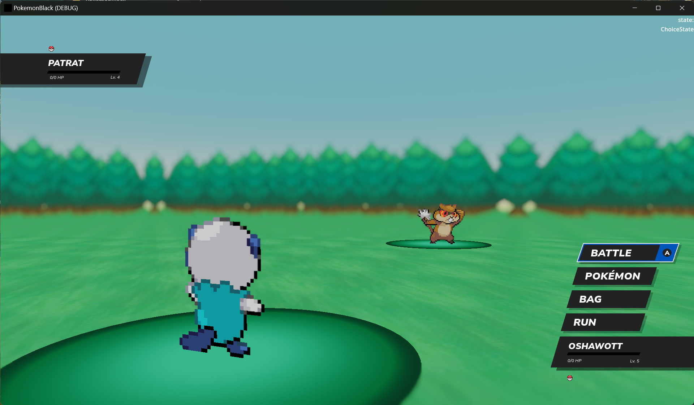

# Pokemon Blinding Black

Pokemon Blinding Black is a small remake of components of Pokemon Black/White made mostly to help me get to grips with Godot after a decade of using Unreal. 
I had a lot of fun messing with DS rom file formats, exporting data from the game and patching it up in blender, and coming up with ways to be faithful but modernize the game. 
In particular, my focus with the project was to build a larger-scale infrastructure in Godot, and provide a useful reference for some pokemon-like systems.

Here's a figma link of the UI work I did for the project: https://www.figma.com/file/LtAXLkywCdqH7oS0fawi9s/Pokemon-Blinding-Black?type=design&node-id=0%3A1&mode=design&t=z4IxBastWEoM1bQk-1 

The game's code is structured with a main world scene. Once the game loads into the main world, it operates on a state stack that pushes and pops scenes like the menu scene, battle scene, etc.
Most of these scenes themselves also use a state stack (like Battle having a MenuState, ChoiceState, etc).

Pokemon data was scraped using a debug tool I wrote from the amazing work at PokeAPI, and formatted for Godot .tres resources and stored in the various data folders. The pokemon mostly follow the structure of the PokeAPI, with the exception of 
a PokemonInstance resource that represents a specific pokemon in the game world.

I'd hoped to get a lot further with this project but got pretty busy (and a full-featured version of this could never be released anyways), so I'm dropping what I completed here! Hopefully the videos and screenshots inspire someone to work on something better.

# Video 

# Screenshots

